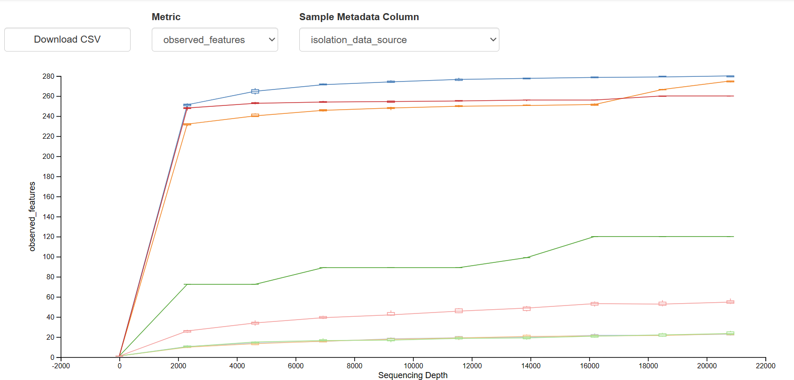
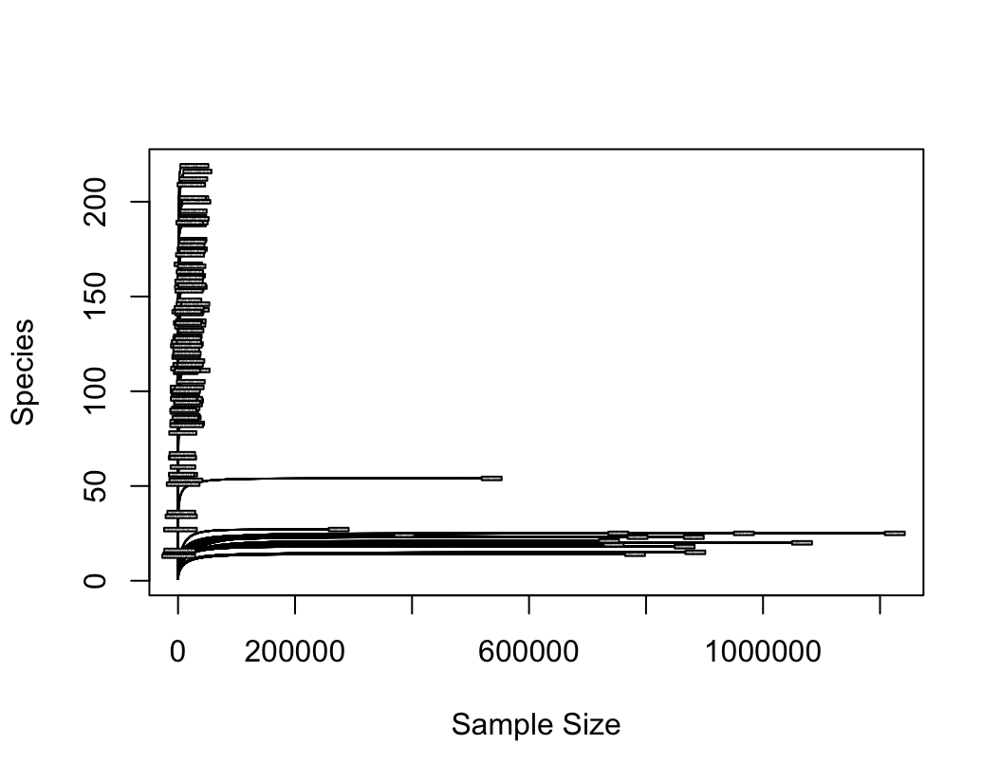
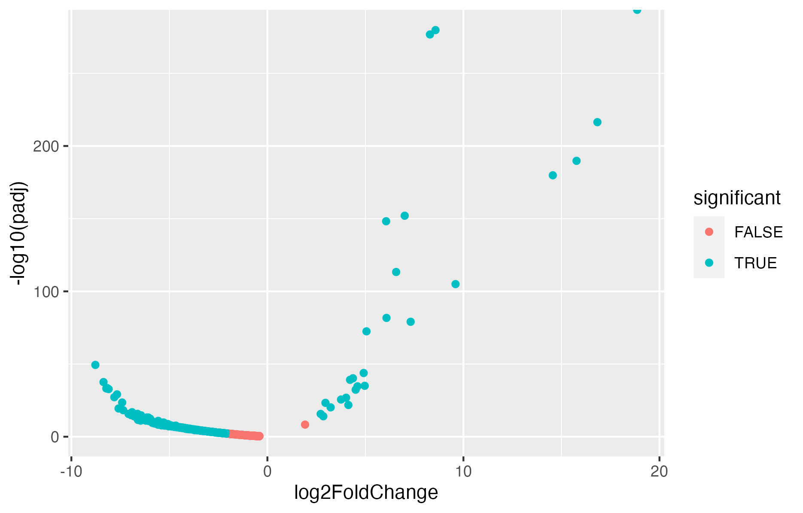

# MICB475 Lab Notebook

## Table of Contents 

| Experiment Number  | Title | Start Date | Pages |
| ------------- | ------------- |---------| ------|
| W5-TM  | [Week 5 Team Meeting](https://github.com/nothanselivander/MICB475_Space/blob/main/Meeting_Minutes/Lab_Notebook.md#w5-tm-week-5-team-meeting) | October 5| -----|
| W6–TM | [Week 6 Team Meeting](https://github.com/nothanselivander/MICB475_Space/blob/main/Meeting_Minutes/Lab_Notebook.md#w6-tm-week-6-team-meeting) | October 12 | ----|
| W7–TM | [Week 7 Team Meeting](https://github.com/nothanselivander/MICB475_Space/blob/main/Meeting_Minutes/Lab_Notebook.md#w7-tm-week-7-team-meeting)| October 19| ----|
|W8–TM | [Week 8 Team Meeting](https://github.com/nothanselivander/MICB475_Space/blob/main/Meeting_Minutes/Lab_Notebook.md#w8-tm-week-8-team-meeting) | October 26 | -----|
| ??? |  Generating phyloseq and running core microbiome, ISA and DESeq2(https://github.com/nothanselivander/MICB475_Space/blob/main/Meeting_Minutes/Lab_Notebook.md#generating-phyloseq-;-running-core-microbiome-,-indicator-species-analysis-,-deseq2) | October 29| ----|
| W9-TM | [Week 9 Team Meeting](https://github.com/nothanselivander/MICB475_Space/blob/main/Meeting_Minutes/Lab_Notebook.md#w9-tm-week-9-team-meeting)  | November 2| ----|

* [Team Meetings](https://github.com/nothanselivander/MICB475_Space/blob/main/Meeting_Minutes/Lab_Notebook.md#team-meetings)
* [Log of Tasks Performed](https://github.com/nothanselivander/MICB475_Space/blob/main/Meeting_Minutes/Lab_Notebook.md#log-of-tasks-performed)

## W5-TM Week 5 Team Meeting
### October 5
#### Agenda  
* Discuss and evaluate the datasets we have available for the ISS
* Review project proposal guidelines 
* Discuss what aim/s and question/s we would like to investigate
* Deciding if we'll push through with abiotic surfaces 
* Discuss how we'll compare the HI-SEAS and dataset/s of choice (i.e. by what metrics)
* Start formatting README file
#### Meeting Minutes 
Discussed locations, materials as potential comparison categories
Discussed combining ISS and Hi-SEAS datasets
* find what terminology means in ISS dataset (eg node)
* discussed combining columns

Next steps:
Create 2 files
* Manifest
* Revised metadata file (potentially combining both Hi-SEAS and ISS data)

Come up with aims for next team meeting 

### October 11
##### Meeting Minutes
Planning on merging ISS and HI-SEAS data

Removing the human swab samples

Deciding on columns to be kept

HI-SEAS
* #SampleID
* collection_device
* collection_timestamp
* orig_env_material

ISS
* sample-id
* collection_date
* isolation_source
* library name
* samp_collect_device

Agreeing on common terminology for locations of samples

Matching up locations based on purpose
* waste & hygiene compartment on ISS = toilet for HI-SEAS
* kitchen counter on Hi-SEAS = dining table Node 1 on ISS

Drafted potential research objectives and experimental aims - recorded on proposal document

## W6-TM Week 6 Team meeting
### October 12
#### Agenda
* Go over research objectives and experimental aims

    Aim 1: General Diversity Comparison
        Aim 1 combines both alpha and beta diversity to compare the overall diversity across datasets. Remove sub-aim 1.
        
    Aim 2: Abiotic Surface Nuances
        In Aim 2, delve into the nuances of abiotic surfaces and compare microbial diversity.
    
    Aim 3: Location-Specific Analysis
        Include taxonomic information through core microbiome analysis and taxa bar plots. Create a Venn diagram for visualization.

    Aim 4: General and Location Comparison
        Introduce indicator taxa analysis. Ideally, we should get very few unique results which indicates both locations have a lot in common.
        Validate findings through differential abundance analysis, which focuses on shared species and their abundance. 

* Consult about changes made to metadata files (data removed, data columns merged, etc)

#### Meeting Minutes
  The columns we kept are good.
    Before we trim in the denoising, we need to send Evelyn the demux file to check the quality score and then she will help us determine the trimming parameters.
    Rarefraction analysis will be done after our proposal. 

 #### October 13
 * metadata file finalised
 * manifest updated to reflect updated metadata
 * demux file sent and confirmed received
 * 293 confirmed as good right trim parameter
 * denoise started

  ## W7-TM Week 7 Team Meeting
  ### October 19
  #### Meeting Minutes
  * previously combine denoised removed reads under 293 
  * redo denoising process in parallel with separate iss and hisease manifests to generate separate files and then merge them into one combined file
  * refer to https://docs.qiime2.org/2023.9/tutorials/fmt/ (ctr-f denoised data) for merging denoised data
  * create alpha refraction curve 
  * reorganize github w/folders 
  * reorganize "readme" - refer to canvas 
  * proposal due date is Oct 25

## W8-TM Week 8 Team Meeting
### October 26 
#### Agenda
* Confirm rarefaction and sampling depth (look over rarefaction curve)
* Discuss which diversity metric tests are important and relevant to our project
* Discuss the prevalence and abundance thresholds we should set for the Venn diagram

#### Team Meeting Minutes
* Selected rarefaction depth at 20810 is good. 
  * Retained  16% feature. 
  * Lab equipment and Sanitation have low amount of samples, can compare, but might not be able to run statistical analyses.
    
* All diversity metrics would be ran
  * Ran everything on qiime first, and narrow down to pick out interesting ones and run on R for publication
  * If all material in ISS in metal, replace the "na" in "material" in metadata with "metal"
  * Kriti generated the diversity metrics on qiime, and we looked at some of them :
    * mostly showed that HISEAS and ISS are significantly different:
      * Faith's: HISEAS more diverse, only lab and sanitation shows similarity but too few sample size (not significant)
      * Weighted unifrac: No overlap --> all very different
      * Evennes: Dramatically higher in HISEAS
      * ISS seems to be driven with uneven population, might have one dominating species --> indicator taxa

  * Other discussion:
    * Why different?
      * ISS is completely sterile, might still be contaminated from earth
      * ISS is shared space with astronauts from other countries, might brought different microbes?
      * ISS has been there ~24 years
      * Paper mentioned most bacteria in ISS form biofilm, if HISEAS can't replicate that == bad model
    * HISEAS team sent an email, so they will read our paper.
    * Team will start using google colab to write code. Code should still be documented in github.
      
  *Next step:
    * Generate phyloseq
    * Start core microbiome and generate venn diagram
    * Organize lab notebook! Should mention date and who did what, errors encountered, figures, and refer to code.
      

## Generating Phyloseq; Running Core Microbiome, Indicator Species Analysis, DESeq2
#### October 29 
* Wenny attempted to generate the phyloseq, encountered an error
  * Files exported: feature_table.tsv, tree.nwk, taxonomy.tsv, project_metadata.tsv 
  * Imported into R, and attempted to generate phyloseq, but encountered an error 
     * Error: OTU and Taxa has different numbers of observed values/rows, samples and features-ID do not match.
     * Hansel confirmed the error
#### October 31
* Wenny generated correct phyloseq, found that the wrong import file was used for the taxa table.
  * scripts/phyloseq was edited (https://github.com/nothanselivander/MICB475_Space/blob/main/scripts/phyloseq)
  * Rstudio/phyloseq.zip was removed and replaced with the correct one (https://github.com/nothanselivander/MICB475_Space/blob/main/Rstudio/phyloseq.zip)
* Kriti reorganized the folders in the server and removed the wrong table and rep_seqs files

  #### November 1
* Hansel adjusted phyloseq file in R:
  * filter out non-bacterial sequences, low-quality samples, and low reads
  * Rarefy:
    * Sample depth =1000
 
    * Changed to sample depth = 5000
        (insert figure)

* Kriti ran ISA
* Irina ran core microbiome and generated venn diagram
* Hansel ran DESeq2
 

## W9-TM Week 9 Team Meeting
### November 2
#### Agenda
* Confirm rarefaction number for R
* Discuss abundance and prevalence numbers for core microbiome analysis
* Review generated plots and other outputs
* * rarefaction curve
  * indicator species results
  * core microbiome venn diagrams
* Discuss proposal
* Discuss formatting etc of lab notebook

#### Meeting Minutes
*

## Log of Tasks Performed

//metadata formatting

October 11
* The team discussed and agreed on the columns of the metadata to be removed
* The team discussed and agreed on samples to be removed
* The team discussed and agreed on the common terminology for labels to be given to locations
* 

// Manifest formatting 

October 12
* Amy imported combined ISS and HISEAS manifest from local computer to server
* Amy imported and demultiplexed the data using the combined manifest
* * Amy initially encountered an error
  * Irina found that it could potentially be the manifest file format that could cause the error
  * Amy fixed the error by converting the csv to a tsv 
* Amy converted the resulting demux.qza to a qzv file

October 13
* Irina looked at the demux.qzv file and proposed 293 as the right trim parameter for denoising the data using DADA
* Irina emailed Evelyn to confirm that this would be a good trim parameter
* Evelyn confirmed that 293 was good
* Irina started denoising the data

October 14
* Denoising of data finished 

