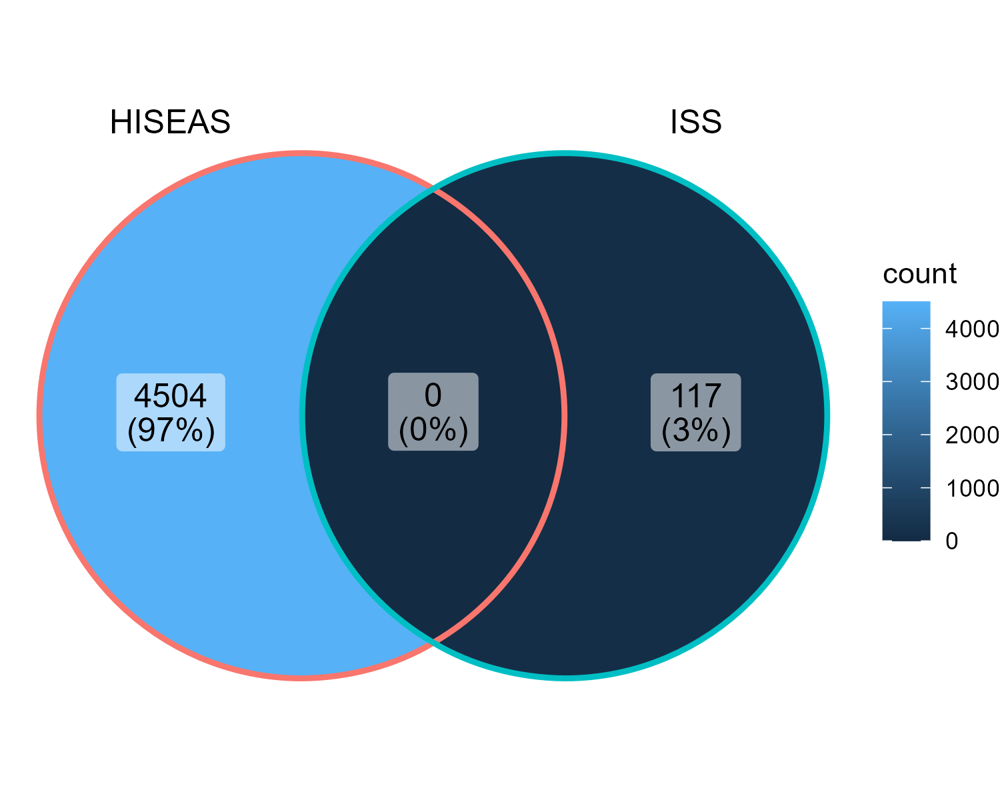
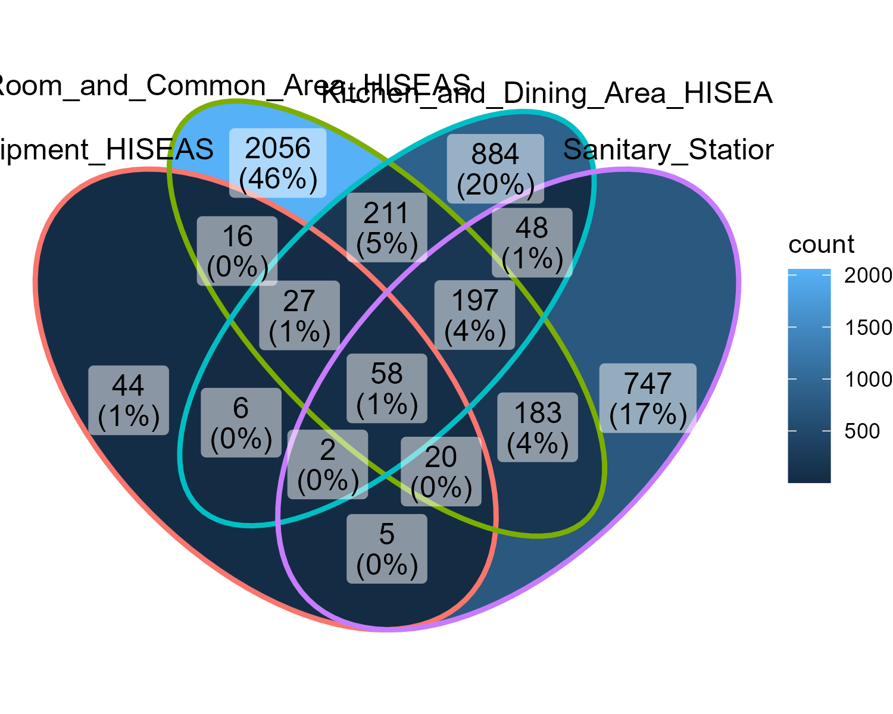
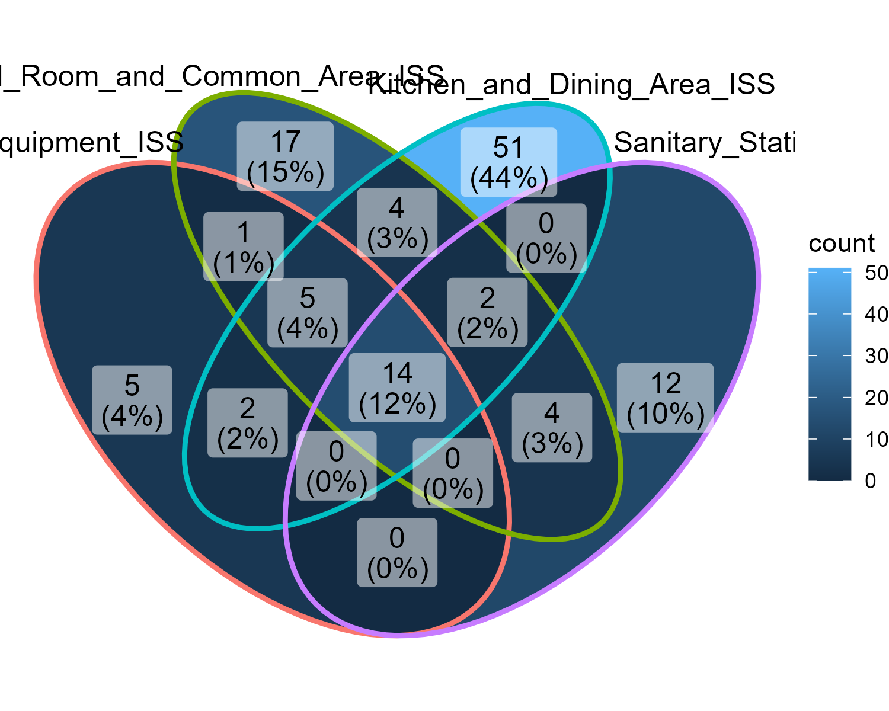

# MICB475 Lab Notebook

## Table of Contents 

| Experiment Number  | Title | Start Date | Pages |
| ------------- | ------------- |---------| ------|
| W5-TM  | [Week 5 Team Meeting](#w5-tm-week-5-team-meeting) | October 5| -----|
| | [Week 5 Team Discussion](#w6-tm-week-6-discussion) | October 11 | ----|
| W6–TM | [Week 6 Team Meeting](#w6-tm-week-6-team-meeting) | October 12 | ----|
| W7–TM | [Week 7 Team Meeting](#w7-tm-week-7-team-meeting)| October 19| ----|
|  | [Initial QIIME2 processing](#initial-qiime2-processing) |October 12|----|
|W8–TM | [Week 8 Team Meeting](#w8-tm-week-8-team-meeting) | October 26 | -----|
|  |  [Generating phyloseq and running core microbiome, Indicator Species Analysis, and DESeq2](#generating-phyloseq-and-running-core-microbiome-indicator-species-analysis-and-deseq2) | October 29| ----|
| W9-TM | [Week 9 Team Meeting](#w9-tm-week-9-team-meeting)  | November 2| ----|
| W10-TM | [Week 10 Team Meeting](#w10-tm-week-10-team-meeting)  | November 9| ----|
| W11-TM | [Week 11 Team Meeting](#w11-tm-week-11-team-meeting)  | November 16| ----|
| W12-TM | [Week 12 Team Meeting](#w12-tm-week-12-team-meeting)  | November 23| ----|
| W13-TM | [Week 13 Team Meeting](#w13-tm-week-13-team-meeting)  | November 30| ----|
| W14-TM | [Week 14 Team Meeting](#w14-tm-week-14-team-meeting)  | November 10| ----|

## W5-TM Week 5 Team Meeting
### October 5
#### Agenda  
* Discuss and evaluate the datasets we have available for the ISS
* Review project proposal guidelines 
* Discuss what aim/s and question/s we would like to investigate
* Deciding if we'll push through with abiotic surfaces 
* Discuss how we'll compare the HI-SEAS and dataset/s of choice (i.e. by what metrics)
* Start formatting README file
#### Meeting Minutes 
Discussed locations, materials as potential comparison categories
Discussed combining ISS and Hi-SEAS datasets
* find what terminology means in ISS dataset (eg node)
* discussed combining columns

Next steps:
*Create 2 files
    * Manifest
    * Revised metadata file (potentially combining both Hi-SEAS and ISS data)
* Come up with aims for next team meeting 

## Week 5 - Team Discussion
### October 11
#### Meeting Minutes
* Planning on merging ISS and HI-SEAS data
* Removing the human swab samples
  
* Columns to be kept
   *HI-SEAS
      * #SampleID
      * collection_device
      * collection_timestamp
      * orig_env_material
   *ISS
      * sample-id
      * collection_date
      * isolation_source
      * library name
      * samp_collect_device

* Agreeing on common terminology for locations of samples
   * Matching up locations based on purpose
   * waste & hygiene compartment on ISS = toilet for HI-SEAS
   * kitchen counter on Hi-SEAS = dining table Node 1 on ISS

* Drafted potential research objectives and experimental aims - recorded on proposal document

## W6-TM Week 6 Team meeting
### October 12
#### Agenda
* Go over research objectives and experimental aims

    Aim 1: General Diversity Comparison
        Aim 1 combines both alpha and beta diversity to compare the overall diversity across datasets. Remove sub-aim 1.
        
    Aim 2: Abiotic Surface Nuances
        In Aim 2, delve into the nuances of abiotic surfaces and compare microbial diversity.
    
    Aim 3: Location-Specific Analysis
        Include taxonomic information through core microbiome analysis and taxa bar plots. Create a Venn diagram for visualization.

    Aim 4: General and Location Comparison
        Introduce indicator taxa analysis. Ideally, we should get very few unique results which indicates both locations have a lot in common.
        Validate findings through differential abundance analysis, which focuses on shared species and their abundance. 

* Consult about changes made to metadata files (data removed, data columns merged, etc)

#### Meeting Minutes
  The columns we kept are good.
    Before we trim in the denoising, we need to send Evelyn the demux file to check the quality score and then she will help us determine the trimming parameters.
    Rarefraction analysis will be done after our proposal. 

  ## W7-TM Week 7 Team Meeting
  ### October 19
  #### Meeting Minutes
  * previously combine denoised removed reads under 293 
  * redo denoising process in parallel with separate iss and hisease manifests to generate separate files and then merge them into one combined file
  * refer to https://docs.qiime2.org/2023.9/tutorials/fmt/ (ctr-f denoised data) for merging denoised data
  * create alpha refraction curve 
  * reorganize github w/folders 
  * reorganize "readme" - refer to canvas 
  * proposal due date is Oct 25

## Initial QIIME2 Processing
### October 12
* Demultiplexing using manifest
   * Amy generated manifest files for ISS and HI-SEAS
   * Amy imported combined ISS and HI-SEAS manifest from local computer to server
   * Amy imported and demultiplexed the data using the combined manifest
      *  Initially encountered an error: ' ' expected afer '"'  
        * Wenny suggested that the problem might be due to the quotation marks in the manifest file or the file format (tsv instead of csv)
           * Irina agreed with the suggestion
           * Amy fixed the error by converting the csv to a tsv 
   * Amy converted the resulting demux.qza to a qzv file
     
* Creating new, organized metadata files
   * Hansel removed unwanted samples and columns, and combined the metadata from both datasets using R
      * Kriti suggested common terminology for comparable locations in the ISS and HI-SEAS datasets. Team agreed on it.
     (insert table)
      * Wenny wrote code for the new column to "rename" the locations
   * [R Code](https://github.com/nothanselivander/MICB475_Space/blob/main/Metadata&Manifest/Metadata.R)
   * [tsv file](https://github.com/nothanselivander/MICB475_Space/blob/main/Metadata&Manifest/Metadata/project_metadata.tsv)
     
 ### October 13
* Denoising 
   * Irina looked at the demux.qzv file and proposed 293 as the right trim parameter for denoising the data using DADA
   * Irina emailed Evelyn to confirm that this would be a good trim parameter
   * Evelyn confirmed that 293 was good
   * Irina started denoising the data
      * Denoising finished – October 14
          
   ### October 19
   * The team realised that the import, demultiplex, and denoising need to occur for the ISS and HISEAS data separately
   * Evelyn confirmed that 292 should be the trim parameter for the data with longer reads
   
   ### October 20
   * Irina imported and demultiplexed the ISS and HISEAS data with separate manifests
   * Irina converted the resulting qza files to qzv files
   * Irina visualised the qzv files and confirmed that 292 and 150 were good right trim parameters for HISEAS and ISS respectively 
   * Irina denoised the ISS data with a right trim parameter of 150
   * Irina started denoising the HISEAS data with a right trim parameter of 292
      * Denoising finished - October 21
   
   ### October 21
   * Irina combined the table.qza and rep-seqs.qza files of both ISS and HISEAS data together
   * Irina converted the resulting qza files to qzv files
     
### October 25
* Training classifier
   * Irina confirmed the primers for training the classifier with Evelyn
   * Irina and Kriti worked on filling in parameters for training the classifier
   * Kriti trained the classifier
     
## W8-TM Week 8 Team Meeting
### October 26 
#### Agenda
* Confirm rarefaction and sampling depth (look over rarefaction curve)
* Discuss which diversity metric tests are important and relevant to our project
* Discuss the prevalence and abundance thresholds we should set for the Venn diagram

#### Team Meeting Minutes
* Selected rarefaction depth at 20810 is good. 
  * Retained  16% feature. 
  * Lab equipment and Sanitation have low amount of samples, can compare, but might not be able to run statistical analyses.
    
* All diversity metrics would be ran
  * Ran everything on qiime first, and narrow down to pick out interesting ones and run on R for publication
  * If all material in ISS in metal, replace the "na" in "material" in metadata with "metal"
  * Kriti generated the diversity metrics on qiime, and we looked at some of them :
    * mostly showed that HISEAS and ISS are significantly different:
      * Faith's: HISEAS more diverse, only lab and sanitation shows similarity but too few sample size (not significant)
      * Weighted unifrac: No overlap --> all very different
      * Evennes: Dramatically higher in HISEAS
      * ISS seems to be driven with uneven population, might have one dominating species --> indicator taxa

  * Other discussion:
    * Why different?
      * ISS is completely sterile, might still be contaminated from earth
      * ISS is shared space with astronauts from other countries, might brought different microbes?
      * ISS has been there ~24 years
      * Paper mentioned most bacteria in ISS form biofilm, if HISEAS can't replicate that == bad model
    * HISEAS team sent an email, so they will read our paper.
    * Team will start using google colab to write code. Code should still be documented in github.
      
  *Next step:
    * Generate phyloseq
    * Start core microbiome and generate venn diagram
    * Organize lab notebook! Should mention date and who did what, errors encountered, figures, and refer to code.
      

## Generating Phyloseq and Running Core Microbiome, Indicator Species Analysis, and DESeq2
### October 29 
* Wenny attempted to generate the phyloseq, encountered an error
  * Files exported: feature_table.tsv, tree.nwk, taxonomy.tsv, project_metadata.tsv 
  * Imported into R, and attempted to generate phyloseq, but encountered an error 
     * Error: OTU and Taxa has different numbers of observed values/rows, samples and features-ID do not match.
     * Hansel confirmed the error
### October 31
* Wenny generated correct phyloseq, found that the wrong import file was used for the taxa table.
  * scripts/phyloseq was edited (https://github.com/nothanselivander/MICB475_Space/blob/main/scripts/phyloseq)
  * Rstudio/phyloseq.zip was removed and replaced with the correct one (https://github.com/nothanselivander/MICB475_Space/blob/main/Rstudio/phyloseq.zip)
* Kriti reorganized the folders in the server and removed the wrong table and rep_seqs files

### November 1
* Hansel adjusted phyloseq file in R:
  * filter out non-bacterial sequences, low-quality samples, and low reads
  * Rarefy:
    * Sample depth =1000
     
    * Changed to sample depth = 5000
        (insert figure)

* Kriti ran ISA
    * Refer to (https://github.com/nothanselivander/MICB475_Space/blob/main/Rstudio/Indicator_Species_Analysis)

* Irina ran core microbiome and generated venn diagrams
  
  
  
* Hansel ran DESeq2
 
* Wenny started reformatting lab notebook

## W9-TM Week 9 Team Meeting
### November 2
#### Agenda
* Confirm rarefaction number for R
* Discuss abundance and prevalence numbers for core microbiome analysis
* Review generated plots and other outputs
* * rarefaction curve
  * indicator species results
  * core microbiome venn diagrams
* Discuss proposal
* Discuss formatting etc of lab notebook

#### Meeting Minutes
* Proposal
   * corrections can net a maximum of 10 points 
   * Title
      * Change title to “comparing --- in a simulation space (HISEASE)” to allow readers to understand what HI-SEAS acronym represents 
   * Intro and background
      * Background ideas weren’t integrated together. Should mention the contrasting findings between the HI-SEAS and ISS ex. the difference in temporal and special findings  
      * Mention the novelty of the study in the introduction and how we’re validating the differences that seem apparent (through the comparison of the results in the two papers referenced)
      * Some info are superfluous, and can be taken out.
   * Experimental aim
      * Too repetitive
      * Combine aim 1 + 2 --> Aim 1: the overall diversity (alpha and beta diversity) between datasets and more nuanced surfaces
      * Combine aim 3 + 4 --> Aim 2: focus on  taxanomic analysis (Core Microbiome, Indicator Taxa Analysis, DESeq2)
         * Note: Venn diagram is an output of the core microbiome, not a separate analysis 
      * Mention what each metric tells you, say what parameters drives the diversity of the community 
   * Approach
      * Proper aim 1 timeline:
        1. reorganize metadata (can mention both data sets have a comparable category and two data sets ran in parallel)
        2. Importing, demux, denoise (each datasets, separately)
        3. Combined datasets
        4. Generate phylogenetic tree
        5. Rarefaction and preform alpha and beta diversity analysis
        6. Regenerate in R
        7. Performed Statistical Analyses
           * PERMANOVA (compare the multiple surfaces) + Wilcoxon (compare between two data sets)
           * both are non parametric approaches? 
      * Proper Aim 2 timeline
         * Generate phyloseq 
         * Perform Differential Abundance, Core Microbiome and Indicator Taxa Analysis
            * (no rarefaction, doesn’t work with this data - filtering is okay)
   * Dataset Overview
      * State reason for selected truncation length 

* Discussion on analyses:
   * Core microbiome, Deseq and Indicator taxa had potentially conflicting information. Let other team members regenerate plots to confirm results.
   * Try generating core microbiome at the genus level?
   * If data generations were correct, blast the ASV of the Xantho genus? (look at the table that Kriti generated to confirm) and compare the ASV between the ---- to check if the ASV's resolve to the same species. (look in the rep seq)
   * NOTE: "If core microbiome is coming up as 0, the deseq should give error and give nothing to compare" (did she change her minds afterwards?)
   * NOTE: can glom the differential abundance? (kriti's plot) to genus or family levels
   * NOTE: Indicator taxa are quite stringent about what is in it vs what is not, so might only get a couple in common. Differential abundance + core microbiome is less stringent

* Lab notebook:
   * don't need to make pages and integerate the tasks performed with the meeting minutes and pictures. 

* Next steps:
   * Proposal revision, due Monday, Nov 6, 2023
   * Team member try to regenerate plots for each taxonomic analyses:
      * Core microbiome - Kriti, Hansel 
      * DeSeq - Irina, Amy
      * ISA – Wenny
   * Try generating core microbiome at genus level?
   * Try BLAST the ASV of Xanthobacteraceae
   * ISA: Make table or venn diagram to summarize
   * Download core microbiome figures
   * Update lab notebook

### November 4
* Irina, Amy, Kriti, Hansel and Wenny edited the proposal 

### November 5
* Irina, Amy, Kriti, Hansel and Wenny completed proposal edits

### November 6
* Irina, Amy, Kriti, Hansel and Wenny performed final reviews on proposal 

## W10-TM Week 10 Team Meeting
### November 9
#### Agenda
* review regenerated ISA, Core microbiome and deseq data
   * Core Microbiome
        * Data source:
           * HISEAS has more diversity but ISS had more read counts
           * According to our table, there are 10,000 unique ASVs but according to CM, there are ~4504 for HISEAS. We lost about 5000 samples.
        * Isolation data source
           * ISS more unique in the sanitary station
           * HISEAS bedroom and common area are more unique

   * Deseq:
        * Only looks at the ASV in common, and if they are up or down-regulated relative to each other. 
        * There are so many significant ASVs shared, so CM should represent them.  

   * ISA: 
        * Even ISA_isolation_data_source shows that there are things shared, just very little.
        * ISS have very few indicator species and there are some unique ones that are not in the HISEAS (row 16 and 9)
        * For our paper, we need to create a table with only the unique ASVs for each dataset and another column specifying the locations where they’re found. Ignore the ones that are shared. Include the indicator value and the p-value; keep the family and genus.  
   
   * Diversity metrics:
        * These metrics also confirm that HISEAS is more diverse

   * Action items:
        * Try to compile all figures and put in the lab notebook
        * Paper needs:
            * One figure of alpha and beta analyses
            * For the CM, only put the data_source figure (the rest go in the supplemental)
            * ISA is a table
            * 

## W11-TM Week 11 Team Meeting
### November 16
#### Agenda
* No meeting this week

## W12-TM Week 12 Team Meeting
### November 23
#### Agenda
* Normal to have core microbiome and indicator taxa metrics to contradict
* For the deseq: The TA's said that if there are different levels of abundance shared (in our case 0), then the code processes it relative to 0 or 1 so they think there’s more up and down reg because there’s to 1??

* Another group reported HISEASE had contamination from the outside
     * possibly soil contamination
     * from team 3, frank zhang (chi et al) includes all the figures generated and reference their paper in our report
 
* Observed traits 
   * Venn diagram: datea source, iss and disease locatios specific 
   * Kitchen, bedroom/common area most diverse + equipment is least diverse

* Deseq is meaningless and do not include
  
* Action items:
     * Regenerate diversity metrics in R
     * create Fig 1. A mix between alpha (Shannon + observed features) and beta (weighted unifrat PCA) diversity
          * have 6 panels
          * Data Source: will have 1 Shannon panel, 1 observed feature panel + 1 weighted unifrat PCA panel
          * Mutated solation data source (the one where the iss and hisease locations are combined) between HIEASE and ISS will have 1 Shannon panel + 1 observed features panel - faceted on R
          * Isolated data source? (the one where the iss and hisease locations are separated) will have 1 PCA panel (not faceted on R)
   * Indicator taxa - write all 28 of them and keep p value and stas value -
     *  indicator (stats) value, remove species (did up to genus level - family, genus - remove domain + phyla) - only include anything above 0.7 - separate into two columns, location and data sets          (maybe organize by family or highest stat value to lowest) can consider color coding
   * have presentation draft ready by next meeting
        * In the presentation - pick one alpha and one beta - say that diversity is different, venn diagram and indicator taxa 

## W13-TM Week 13 Team Meeting 
# Meeting Agenda
# December 30, 2023
* Go over draft slides:
  * Statistical testing: Wilcox or Kruskal for data source? PERMANOVA for isolation_data_source?
  * Ellipses for PCOA
  * How to present the ISA 

# Meeting Minutes
* Draft slides:
   * Title: No. HISEAS (give context)  MODEL IS A POOR MODEL.
   * Intro: What HISEAS is. Why we do it. Explain ISS. Add picture
        * Impact on astronauts health, etc. but keep it brief
        * bigger fonts
        * Explain what kinds of data they collected
* Research question. Let’s not have a hypothesis.
* Research aims: make it more succint
    * Explain how we organize our data --> Grouping ISS and HISEAS data (have a diagram)
        * grouping
* Fig 1 and 2: Remove text
   * Which Statistical testing
     * Data source: Kruskal, isolated mutation source: PERMANOVA. Add a p value.
   * Fig 1b, show shannon only
   * Fig 2, generate ellipses 
* For ITA explain using use text, we have 12 ita for hiseas and 5 for iss. Discuss some of the interesting ones: shared

* Briefly mention limitation — > think of future directions:
   * different datasets
   * different sample sizes
   *  different people
   *  differences in datasets themselves that we don’t know 

* Future directions:
   * Comparable collection
   * Future studies can just be done directly in the ISS

* Conclusion - not completed yet
* Acknowledgement to the department

  
## W14-TM Week 14 Team Meeting 
# December 7, 2023
# Agenda
   * Discuss statistical analyses
   * Discuss draft manuscript

# Minutes
